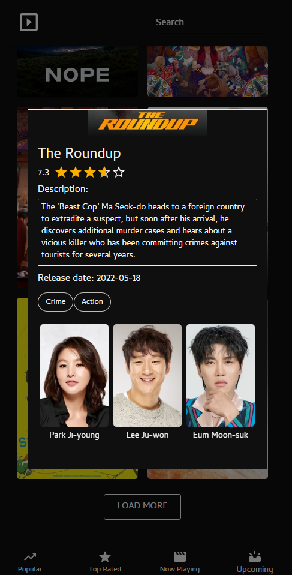

<h1>Movie Guide</h1>

Check out the Live Demo link in the Description!

<h3>Features</h3>
<ul>
<li>View Trending, Top Rated, New Releases and Upcoming Movies.</li>
<li>Clickable images that shows a modal with additional info about the movie. Such as actors, genres and description.</li>
<li>Search function for movies.</li>
<li>Sort function to sort the movies by Alphabetical, Rating Ascending/Descending and Release date Ascending/Descending.</li>
</ul>

<h3>Built using</h3>
<ul>
<li><a href="https://reactjs.org/" target="_blank">React</a></li>
<li><a href="https://reactrouter.com/" target="_blank">React Router</a></li>
<li><a href="https://mui.com/" target="_blank">Material UI with custom styling</a></li>
<li><a href="https://www.npmjs.com/package/react-alice-carousel" target="_blank">Alice Carousel - (Carousel used for Actors in the Movie Modal)</a></li>
<li><a href="https://developers.themoviedb.org/3/getting-started/introduction" target="_blank">Axios</a></li>
<li><a href="https://developers.themoviedb.org/3/getting-started/introduction" target="_blank">The Movie Database API</a></li>
</ul>

<h3>Screenshots</h3>

<h5>Desktop</h5>

<h5>Mobile</h5>

